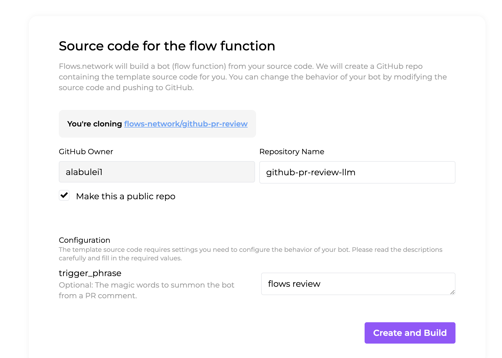
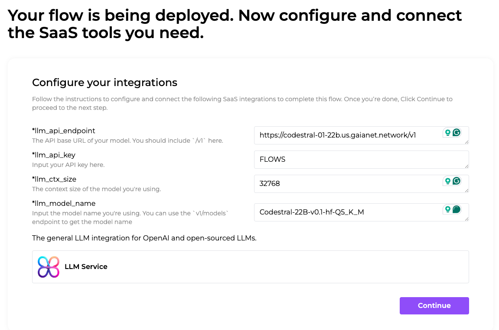
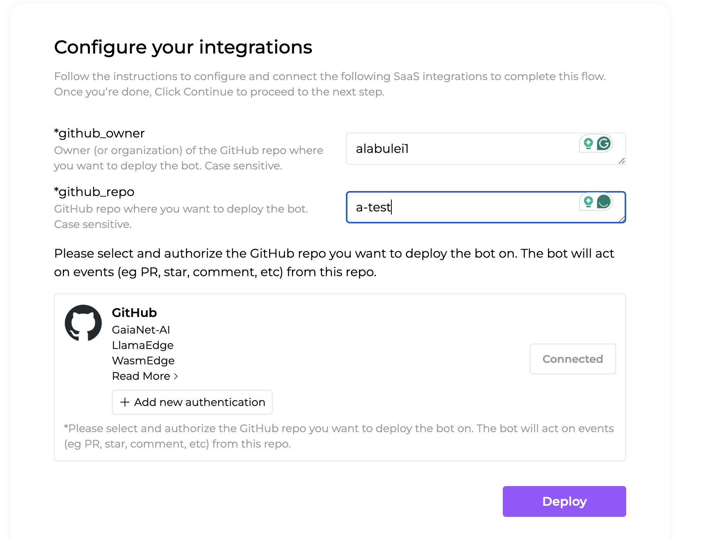

# 
Agent to review code in Github PRs

  
  
   

[Deploy this function on flows.network](https://flows.network/flow/createByTemplate/github-pr-review-llm), and you will get an AI agent to review changed source code files in GitHub Pull Requests. It helps busy open source contributors understand and make decisions on PRs faster! Here are some examples. Notice how the code review bot provides code snippets to show you how to improve the code!

> We recommend you to use a [Gaia node](https://github.com/GaiaNet-AI/gaianet-node) running an open source coding LLM as the backend to perform PR reviews and summarizations. You can use [a community node](https://docs.gaianet.ai/user-guide/nodes#codestral) or run a node [on your own computer](https://github.com/GaiaNet-AI/node-configs/tree/main/codestral-0.1-22b)!

* [[C++] Improve the WasmEdge C++ SDK](https://github.com/WasmEdge/WasmEdge/pull/2428#issuecomment-1524733889)
* [[C++] Create an OpenCV plugin for WasmEdge](https://github.com/WasmEdge/WasmEdge/pull/2403#issuecomment-1509595889)
* [[Haskell] Improve WasmEdge Component Model tooling](https://github.com/second-state/witc/pull/73#issuecomment-1509586233)

This bot reviews **changed files in the PR**. Alternatively, you can use [this bot](https://github.com/flows-network/github-pr-summary) to summarize commits in the PR.

## How it works

This flow function is triggered when a new PR is raised in the designated GitHub repo. The flow function collects the changed files in the PR, and asks ChatGPT/4 to review and summarize it. The result is then posted back to the PR as a comment. The flow functions are written in Rust and run in hosted [WasmEdge Runtimes](https://github.com/wasmedge) on [flows.network](https://flows.network/).

* The code review comment is updated automatically every time a new commit is pushed to this PR.
* A new code review could be triggered when someone says a magic *trigger phrase* in the PR's comments section. The default trigger phrase is "flows review".

## Deploy your own code review bot in 3 simple steps

1. Create a bot from template
2. Connect to an LLM
3. Connect to GitHub for access to the target repo

### 0 Prerequisites

You will also need to sign into [flows.network](https://flows.network/) from your GitHub account. It is free.

### 1 Create a bot from template

Create a flow function from [this template](https://flows.network/flow/createByTemplate/github-pr-review-llm).
It will fork a repo into your personal GitHub account. Your flow function will be compiled from the source code
in your forked repo. You can configure how it is summoned from the GitHub PR.

* `trigger_phrase` : The magic words to write in a PR comment to summon the bot. It defaults to "flows review".

Click on the **Create and Build** button.

> Alternatively, fork this repo to your own GitHub account. Then, from [flows.network](https://flows.network/), you can **Create a Flow** and select your forked repo. It will create a flow function based on the code in your forked repo. Click on the **Advanced** button to see configuration options for the flow function.

### 2 Connect to an LLM

Configure the LLM API service you want to use to review the PRs.

* `llm_api_endpoint` : The OpenAI compatible API service endpoint for the LLM to conduct code reviews. We recommend the [Codetral Gaia node](https://github.com/GaiaNet-AI/node-configs/tree/main/codestral-0.1-22b): `https://codestral.us.gaianet.network/v1`
* `llm_model_name` : The model name required by the API service. We recommend the following model name for the above public Gaia node: `codestral`
* `llm_ctx_size` : The context window size of the selected model. The Codestral model has a 32k context window, which is `32768`.
* `llm_api_key` : Optional: The API key if required by the LLM service provider. It is not required for the Gaia node.

Click on the **Continue** button.

### 3 Connect to GitHub for access to the target repo

Next, you will tell the bot which GitHub repo it needs to monitor for upcoming PRs to review.

* `github_owner`: GitHub org for the repo you want to review PRs
* `github_repo` : GitHub repo you want to review PRs

> Let's see an example. You would like to deploy the bot to review code in PRs on `WasmEdge/wasmedge_hyper_demo` repo. Here `github_owner = WasmEdge` and `github_repo = wasmedge_hyper_demo`.

Finally, the GitHub repo will need to give you access so that the flow function can access and review its PRs!
Click on the **Connect** or **+ Add new authentication** button to give the function access to the GitHub repo. You'll be redirected to a new page where you must grant flows.network permission to the repo.

Click on **Deploy**.

### Wait for the magic!

This is it! You are now on the flow details page waiting for the flow function to build. As soon as the flow's status became `running`, the bot is ready to give code reviews! The bot is summoned by every new PR, every new commit, as well as magic words (i.e., `trigger_phrase`) in PR comments.

## FAQ

### Customize the bot

The bot's source code is available in the GitHub repo you cloned from the template. Feel free to make changes to the source code (e.g., model, context length, API key and prompts) to fit your own needs. If you need help, [ask in Discord](https://discord.gg/ccZn9ZMfFf)!

### Use the bot on multiple repos

You can [mannually create a new flow](https://flows.network/flow/new) and import the source code repo for the bot (i.e., the repo you cloned from the template). Then, you can use the flow config to specify the `github_owner` and `github_repo` to point to the target repo you need to deploy the bot on. Deploy and authorize access to that target repo.

You can repeat this for all target repos you would like to deploy this bot on.

> You could have a single flow function repo deployed as the source code for multiple bots. When you update the source code in the repo, and push it to GitHub, it will change the behavior of all the bots.

### Change the magic phrase

Go to the "Settings" tab of the running flow function for the bot, you can update the `trigger_phrase` config. The value of this config is the magic phrase the user will say to trigger a review from a PR comment.

## Credits

This flow function is originally created by [Jay Chen](https://github.com/jaykchen), and [jinser](https://github.com/jetjinser) made significant contributions to optimize the event triggers from GitHub.

